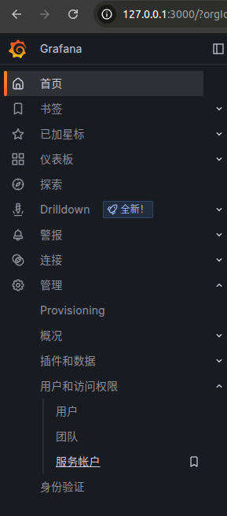
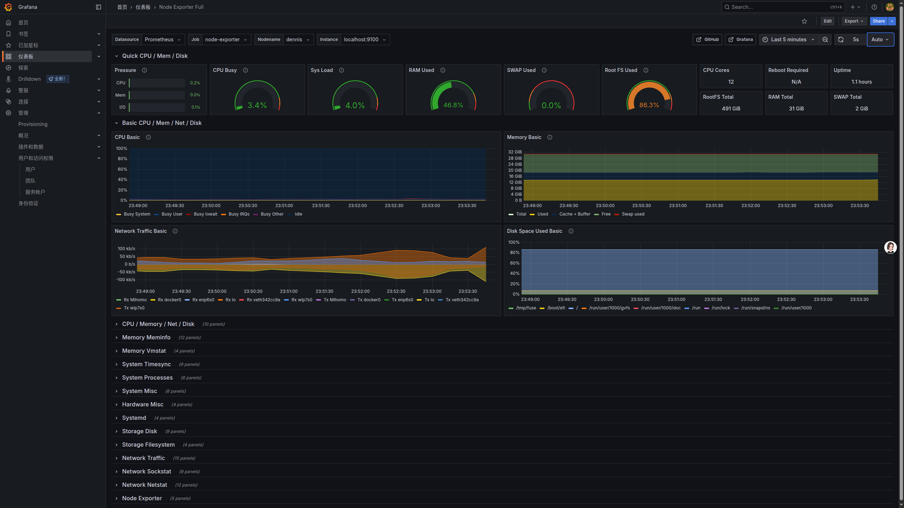
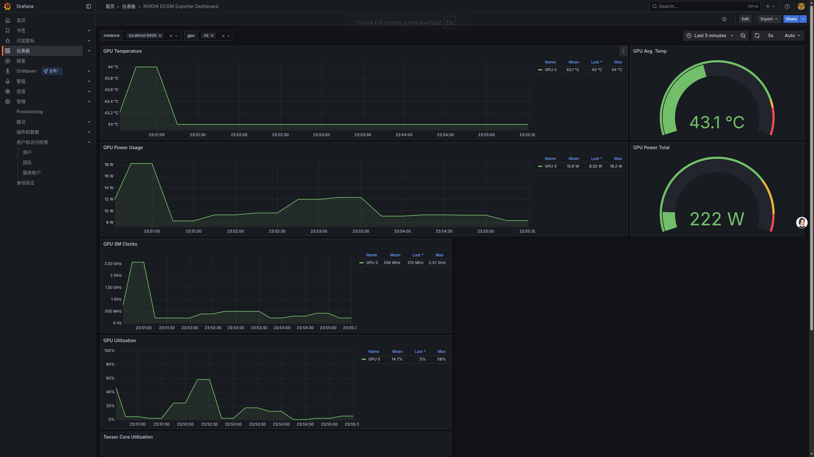

<div style="
    display: flex;
    justify-content: space-between;
    align-items: center;
    border-top: 3px solid #007bff;    /* 顶部蓝色边框 */
    padding: 8px 0;                    /* 顶部和底部留白 */
">
  <h1 style="margin: 0;">系统监控部署脚本 (Ubuntu)</h1>
  <a href="./docs/README_en.md">English</a>
</div>


本脚本在 Ubuntu 22.04 上一键安装并配置以下组件：  
- **NVIDIA DCGM**（数据中心 GPU 管理器）  
- **dcgm-exporter**（Prometheus GPU 指标导出器）  
- **Prometheus**（指标采集与存储）  
- **Grafana**（可视化仪表盘）  
- **node_exporter**（CPU、内存、磁盘、网络、负载等系统指标导出器）

## 目录

- [目录](#目录)
- [前置要求](#前置要求)
- [使用方法](#使用方法)
- [脚本特性](#脚本特性)
- [执行流程](#执行流程)
- [默认仪表盘](#默认仪表盘)
- [配置说明](#配置说明)
- [故障排查](#故障排查)

## 前置要求

- Ubuntu 22.04 LTS（已测试）  
- **sudo** 权限  
- 网络连接（或通过环境变量配置代理）  
- `bash` Shell

## 使用方法

1. **下载或克隆脚本**：
   ```bash
   git clone https://github.com/Dennis-Chen2021/hardware-monitor-deploy.git
   cd hardware-monitor-deploy
   chmod +x hardware-monitor-deploy.sh
   ```

2. **（可选）配置代理**：若需要使用 HTTP/HTTPS 代理，请修改脚本顶部的 `http_proxy` 和 `https_proxy` 变量。

3. **执行脚本**：
   ```bash
   sudo ./hardware-monitor-deploy.sh
   ```
   脚本会提示你输入 Grafana 凭据或已有的 API Token。（⚠️ **注意：** 关于API Token 获取，可以登陆http://<服务器IP>:3000,当然若是在本机部署的话，也可以使用`127.0.0.1:3000`来打开Grafana界面,在左侧导航栏中的 `管理->用户和访问权限中->服务账户` 中获取）示例图如下:
  
  
4. **实际效果展示**：
  
  **4.1 Node Exporter Full**


  **4.2 NVIDIA DCGM Exporter Dashboard**

## 脚本特性

- Go 安装 (v1.23.8)  
- jq 安装（用于解析 JSON）  
- DCGM 安装与服务启用  
- dcgm-exporter 编译、安装及服务注册  
- Prometheus 安装、配置及服务注册  
- Grafana 安装及仪表盘自动导入  
- node_exporter 安装及服务注册（系统指标监控）  
- 自动更新 Prometheus 抓取配置（GPU & 系统指标）

## 执行流程

1. 可选：设置代理  
2. 安装或升级 Go  
3. 安装 jq  
4. 安装 NVIDIA DCGM  
5. 编译并安装 dcgm-exporter  
6. 注册 dcgm-exporter 服务  
7. 安装 Prometheus 并生成配置  
8. 注册 Prometheus 服务  
9. 安装 Grafana  
10. 自动导入 Grafana 仪表盘  
11. 安装 node_exporter  
12. 注册 node_exporter 服务  
13. 更新配置并重启 Prometheus

## 默认仪表盘

- GPU 指标：ID `12239` (NVIDIA DCGM Dashboard)  
- 系统指标：ID `1860` (Node Exporter Full)

访问 Grafana：`http://<服务器IP>:3000`，默认凭据：

```
用户名：admin  
密码：admin
```

## 配置说明

- 版本变量：修改脚本顶部的 `GO_VERSION`、`PROM_VERSION`、`NODE_EXPORTER_VERSION`。  
- 绑定地址：dcgm-exporter 默认监听 `0.0.0.0:9400`，如需更改请修改 service 文件。  
- Prometheus 配置：位于 `/opt/prometheus/prometheus.yml`。

## 故障排查

- 查看服务状态：
  ```bash
  systemctl status dcgm-exporter prometheus grafana-server node_exporter
  ```
- 查看日志：
  ```bash
  journalctl -u dcgm-exporter -f
  journalctl -u prometheus -f
  journalctl -u grafana-server -f
  journalctl -u node_exporter -f
  ```
- 网络与端口：确保 `9400`、`9100`、`9090`、`3000` 已放行。
