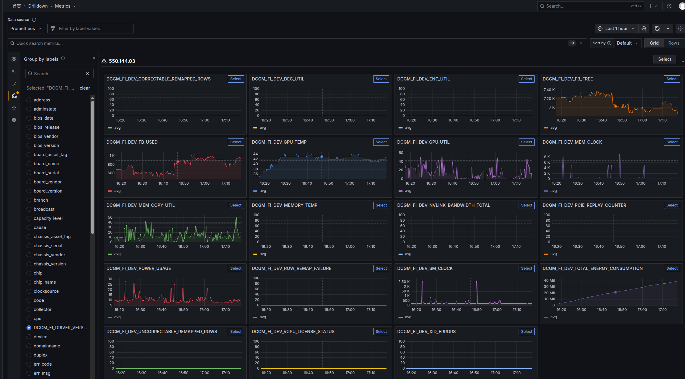

### 前言

在大规模 GPU 集群运维与性能调优中，精准、全面地了解每块显卡的运行状态和健康状况至关重要。NVIDIA 数据中心 GPU 管理 (DCGM) 提供了一系列关键指标，用于监控显存错误、硬件利用率、温度、能耗以及互联带宽等多维度信息。通过对这些指标的持续采集与分析，运维人员可以：

- **及时发现与定位** ECC 内存错误与硬件故障，保障系统稳定性；  
- **量化计算与传输负载**，优化任务调度与资源分配；  
- **监控温度与能耗**，平衡性能与功耗，延长设备寿命；  
- **洞察互联带宽与链路质量**，提升多 GPU 协同效率；  
- **跟踪虚拟化授权与驱动错误**，确保虚拟化环境与驱动可靠性。

下表详细列出了常见的 DCGM 设备级别指标及其含义，供集群部署、监控与故障排查时参考。  

| 指标名                           | 含义                                                         |
|----------------------------------|--------------------------------------------------------------|
| CORRECTABLE_REMAPPED_ROWS        | 可纠正 ECC（单比特）错误所在的内存行，被硬件检测后重映射到备用行的次数。 |
| UNCORRECTABLE_REMAPPED_ROWS      | 不可纠正 ECC（多比特）错误所在的内存行，被硬件检测后重映射到备用行的次数。 |
| ROW_REMAP_FAILURE                | 硬件尝试重映射有 ECC 错误的内存行失败的次数。                 |
| DEC_UTIL                         | 硬件视频解码器（NVDEC）的利用率百分比。                      |
| ENC_UTIL                         | 硬件视频编码器（NVENC）的利用率百分比。                      |
| FB_FREE                          | GPU 帧缓冲区中尚未使用的显存容量。                           |
| FB_USED                          | GPU 帧缓冲区中已被占用的显存容量。                           |
| GPU_TEMP                         | GPU 核心温度（℃）。                                         |
| MEMORY_TEMP                      | 显存（VRAM）温度（℃）。                                      |
| GPU_UTIL                         | GPU SM 核的利用率百分比。                                    |
| MEM_COPY_UTIL                    | 内存拷贝引擎（DMA engine）的利用率百分比。                  |
| MEM_CLOCK                        | GPU 全局内存控制器的时钟频率（MHz）。                         |
| SM_CLOCK                         | GPU SM 核心的运行时钟频率（MHz）。                           |
| NVLINK_BANDWIDTH_TOTAL           | 所有 NVLink 通道合计的带宽利用率（GB/s）。                    |
| PCIE_REPLAY_COUNTER              | PCIe 链路重传（Replay）事件计数。                            |
| POWER_USAGE                      | 当前功耗（W）。                                              |
| TOTAL_ENERGY_CONSUMPTION         | 自部署以来累计的总能量消耗（J）。                            |
| VGPU_LICENSE_STATUS              | vGPU 许可证状态（1=有效，0=无效）。                         |
| XID_ERRORS                       | 驱动报告的 XID 错误计数，反映严重硬件或驱动故障。            |
